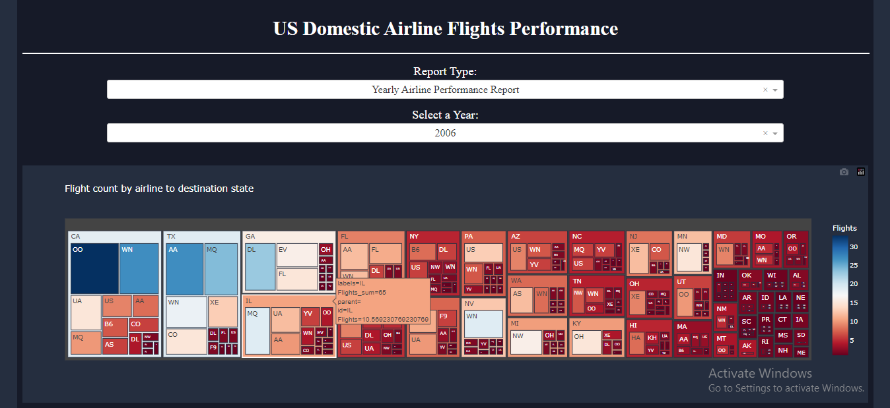
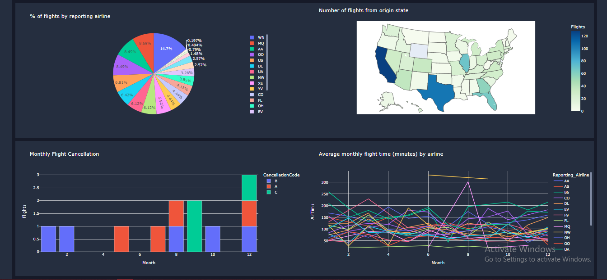
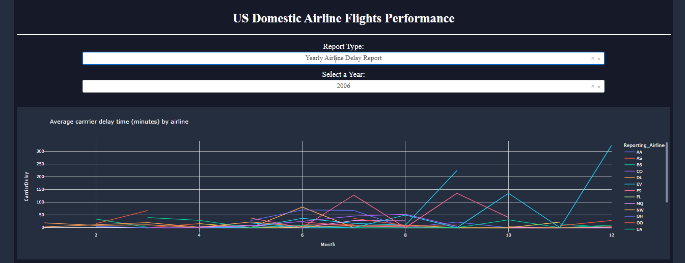
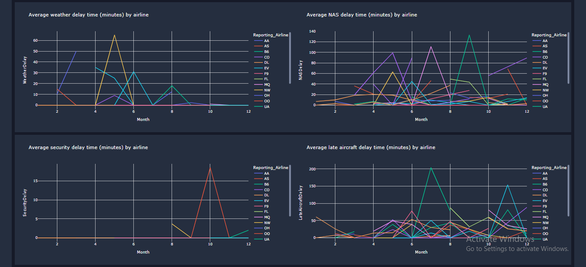

# Flight-Delay-Time-Statistics-Dashboard

## Dataset Used

[Airline Reporting Carrier On-Time Performance](https://developer.ibm.com/exchanges/data/all/airline/?utm_medium=Exinfluencer&utm_source=Exinfluencer&utm_content=000026UJ&utm_term=10006555&utm_id=NA-SkillsNetwork-Channel-SkillsNetworkCoursesIBMDeveloperSkillsNetworkDV0101ENSkillsNetwork970-2022-01-01&cm_mmc=Email_Newsletter-_-Developer_Ed%2BTech-_-WW_WW-_-SkillsNetwork-Courses-IBMDeveloperSkillsNetwork-DV0101EN-SkillsNetwork-20297740&cm_mmca1=000026UJ&cm_mmca2=10006555&cm_mmca3=M12345678&cvosrc=email.Newsletter.M12345678&cvo_campaign=000026UJ) dataset from [Data Asset eXchange](https://developer.ibm.com/exchanges/data/?utm_medium=Exinfluencer&utm_source=Exinfluencer&utm_content=000026UJ&utm_term=10006555&utm_id=NA-SkillsNetwork-Channel-SkillsNetworkCoursesIBMDeveloperSkillsNetworkDV0101ENSkillsNetwork970-2022-01-01&cm_mmc=Email_Newsletter-_-Developer_Ed%2BTech-_-WW_WW-_-SkillsNetwork-Courses-IBMDeveloperSkillsNetwork-DV0101EN-SkillsNetwork-20297740&cm_mmca1=000026UJ&cm_mmca2=10006555&cm_mmca3=M12345678&cvosrc=email.Newsletter.M12345678&cvo_campaign=000026UJ)

## Dashboard Components

 Two dropdown menus: For choosing report type and year.
There are 5 graphs for each report.

1. For Yearly airline performance report.

   - Number of flights under different cancellation categories using bar chart.
   - Average flight time by reporting airline using line chart.
   - Percentage of diverted airport landings per reporting airline using pie chart.
   - Number of flights flying from each state using choropleth map.
   - Number of flights flying to each state from each reporting airline using treemap chart.

2. For Yearly average flight delay statistics.

   - Monthly average carrier delay by reporting airline for the given year.
   - Monthly average weather delay by reporting airline for the given year.
   - Monthly average national air system delay by reporting airline for the given year.
   - Monthly average security delay by reporting airline for the given year.
   - Monthly average late aircraft delay by reporting airline for the given year.

## Screenshots

1. Yearly airline performance report.

2.  Yearly average flight delay statistics.

## Built With

- [Dash](https://dash.plotly.com/) - Main server and interactive components
- [Plotly Python](https://plotly.com/python/) - Used to create the interactive plots
